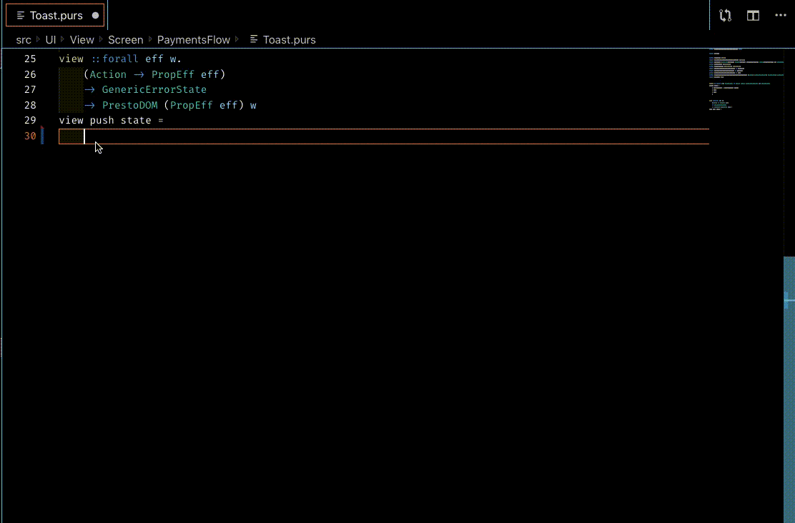

# PrestoDom Snippets

Code Snippets for PrestDom in PureScript Syntax

## Usage

Type part of a snippet, press `enter`, and the snippet unfolds.

### View Snippets

| Snippet              | Purpose                                            |
| -------------------- | -------------------------------------------------- |
| `_ll`                | linearLayout                                       |
| `_rl`                | relativeLayout                                     |
| `_tv`                | textView                                           |
| `_et`                | editText                                           |
| `_iv`                | imageView                                          |
| `_llHW`              | linearLayout with weight "1" and width $ V 1       |
| `_llVW`              | linearLayout with weight "1" and height $ V 1      |

### Prop Snippets

| Snippet              | Purpose                                            |
| -------------------- | -------------------------------------------------- |
| `_sh`                | shadow                                             |
| `_mg`                | margin                                             |
| `_pd`                | padding                                            |

## Installation

1. Install Visual Studio Code 1.35.1 or higher
2. Launch Code
3. From the command palette `Ctrl`-`Shift`-`P` (Windows, Linux) or `Cmd`-`Shift`-`P` (OSX)
4. Type and Select `Install Extension`
5. Search `PrestoDom Snippets` and click install
6. Done