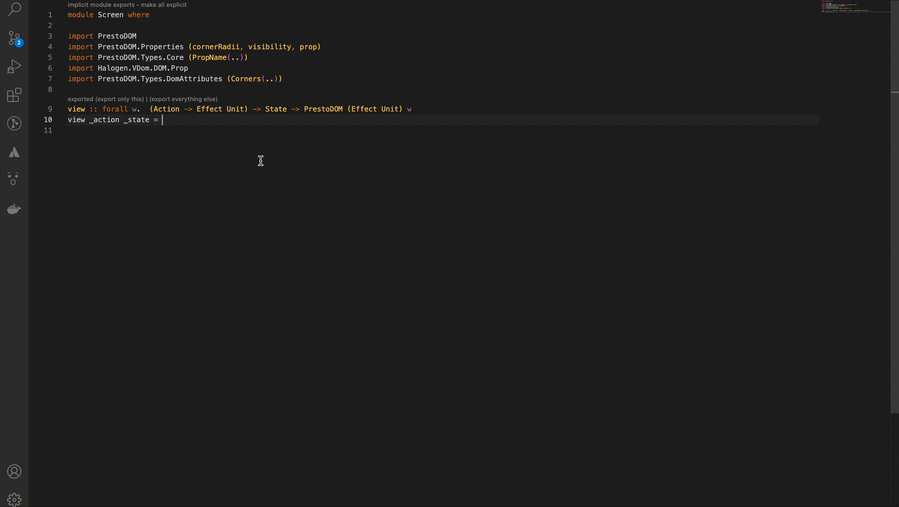

# Purescript PrestoDom Snippets &nbsp; 

<!--  -->

Code Snippets for PrestDom in PureScript Syntax

P.S. This is updated version of [vsce-presto-dom](https://github.com/iarthstar/vsce-presto-dom)
## 😇  Usage

Type part of a snippet, press `enter`, and the snippet unfolds.

### Screen Snippets

| Snippet              | Purpose                                                     |
| -------------------- | ----------------------------------------------------------- |
| `_screen`            | The basic screen code with types, views and controllers.    |
| `_screen:types`      | The basic screen types for the screen with default values   |
| `_screen:view`       | The basic view of the screen using Presto Dom               |
| `_screen:controller` | All actions which can be performed on the screen.           |

### View Snippets

| Snippet              | Purpose                                            |
| -------------------- | -------------------------------------------------- |
| `_ll`                | linearLayout                                       |
| `_rl`                | relativeLayout                                     |
| `_llHW`              | linearLayout with weight "1" and width $ V 1       |
| `_llVW`              | linearLayout with weight "1" and height $ V 1      |
| `_tv`                | textView                                           |
| `_et`                | editText                                           |
| `_iv`                | imageView                                          |

### Prop Snippets

| Snippet              | Purpose                                            |
| -------------------- | -------------------------------------------------- |
| `_cr`                | CornerRadii                                        |
| `_sh`                | Shadow                                             |
| `_mg`                | Margin                                             |
| `_pd`                | Padding                                            |

### Misc Snippets

| Snippet              | Purpose                                            |
| -------------------- | -------------------------------------------------- |
| `_acc`               | accessor                                           |
| `_di`                | derive instance                                    |

## ⭐ Installation

1. Install Visual Studio Code 1.35.1 or higher
2. Launch Code
3. From the command palette `Ctrl`-`Shift`-`P` (Windows, Linux) or `Cmd`-`Shift`-`P` (OSX)
4. Type and Select `Install Extension`
5. Search `Purescript PrestoDom Snippets` and click install
6. Done

## 👍 Contribution
1. Fork it
2. Create your feature branch (git checkout -b my-new-feature)
3. Commit your changes (git commit -m 'Added some new snippet')
4. Push to the branch (git push origin my-new-feature)
5. Create new Pull Request

### What can you contribute
1. Add more snippets which you use day to day
2. Find bugs or errors or suggest some new idea.
3. Add some cool snippets.

## Facing Any Problem or need any Help:grey_question:
Incase you face any problem or need any help write me in [issues](https://github.com/Shreyans13/Purescript-PrestoDom-Snippets/issues) section. 
